# AI Token Tracker (AITT) for Stream Deck

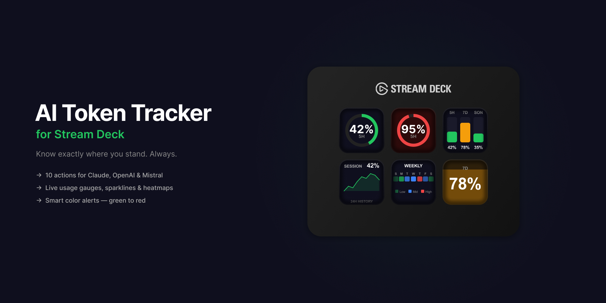

### Know exactly where you stand. Always.

**Stop guessing your AI usage. See it live on your Stream Deck.**

---

## Why?

You're deep in a coding session. You're in the flow. And then — *rate limited*.

**AI Token Tracker (AITT)** puts your usage right where you can see it: on your Stream Deck. One glance. No browser tab. No guessing.

---

## 10 actions for your Stream Deck

| | Action | What it shows |
|:---:|:---|:---|
| **Claude** | Session Usage | Your 5-hour rolling window |
| | Weekly Usage | 7-day usage across all models |
| | Sonnet Usage | Sonnet-specific weekly limit |
| | Usage Overview | Everything on one key |
| | Cost Estimate | Estimated spend in real $ |
| | Model Comparison | Side-by-side bars per metric |
| | Sparkline History | 24h mini chart of your usage |
| | Weekly Heatmap | 7-day intensity grid |
| **OpenAI** | OpenAI Usage | Connection status or spend (admin key) |
| **Mistral** | Mistral Usage | Connection status + available models |

---

### 3 Display Styles

Choose the visualization that fits your workflow

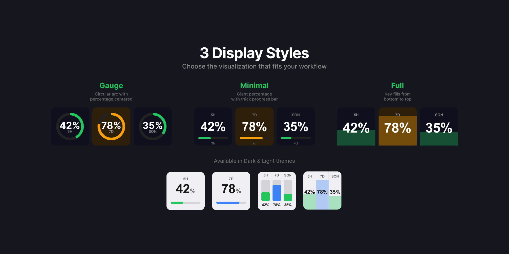

*Available in Dark & Light themes*

---

## Display styles

### Gauge

Circular arc with percentage centered inside. The arc shape conveys progress before you read the number.

<table>
<tr>
<td></td>
<td align="center"><strong>Session 5H</strong></td>
<td align="center"><strong>Weekly 7D</strong></td>
<td align="center"><strong>Sonnet</strong></td>
<td align="center"><strong>Overview</strong></td>
<td align="center"><strong>Critical</strong></td>
</tr>
<tr>
<td><strong>Dark</strong></td>
<td align="center">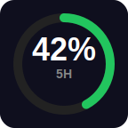</td>
<td align="center">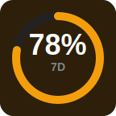</td>
<td align="center">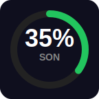</td>
<td align="center">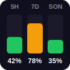</td>
<td align="center">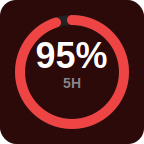</td>
</tr>
<tr>
<td><strong>Light</strong></td>
<td align="center">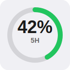</td>
<td align="center">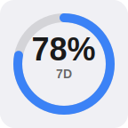</td>
<td align="center">—</td>
<td align="center">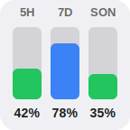</td>
<td align="center">—</td>
</tr>
</table>

### Minimal

Giant percentage with a thick progress bar. Maximum readability.

<table>
<tr>
<td></td>
<td align="center"><strong>Session 5H</strong></td>
<td align="center"><strong>Weekly 7D</strong></td>
<td align="center"><strong>Sonnet</strong></td>
<td align="center"><strong>Overview</strong></td>
</tr>
<tr>
<td><strong>Dark</strong></td>
<td align="center">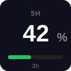</td>
<td align="center">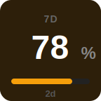</td>
<td align="center">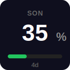</td>
<td align="center">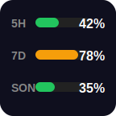</td>
</tr>
<tr>
<td><strong>Light</strong></td>
<td align="center">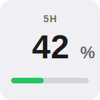</td>
<td align="center">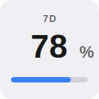</td>
<td align="center">—</td>
<td align="center">—</td>
</tr>
</table>

### Full

The entire key fills from bottom to top. The most immersive at-a-glance view.

<table>
<tr>
<td></td>
<td align="center"><strong>Session 5H</strong></td>
<td align="center"><strong>Weekly 7D</strong></td>
<td align="center"><strong>Sonnet</strong></td>
<td align="center"><strong>Overview</strong></td>
<td align="center"><strong>Critical</strong></td>
</tr>
<tr>
<td><strong>Dark</strong></td>
<td align="center">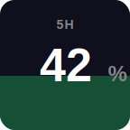</td>
<td align="center">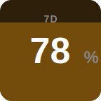</td>
<td align="center">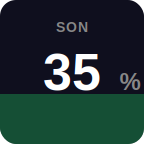</td>
<td align="center">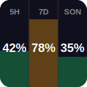</td>
<td align="center">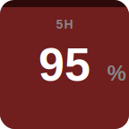</td>
</tr>
<tr>
<td><strong>Light</strong></td>
<td align="center">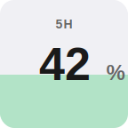</td>
<td align="center">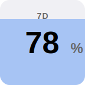</td>
<td align="center">—</td>
<td align="center">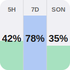</td>
<td align="center">—</td>
</tr>
</table>

---

## Advanced visualizations

These actions have a fixed layout — no Display Style selector needed.

<table>
<tr>
<td align="center"><strong>Cost Estimate</strong></td>
<td align="center"><strong>Model Comparison</strong></td>
<td align="center"><strong>Sparkline 24h</strong></td>
<td align="center"><strong>Weekly Heatmap</strong></td>
</tr>
<tr>
<td align="center">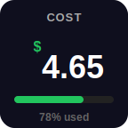</td>
<td align="center">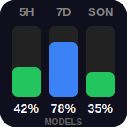</td>
<td align="center">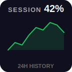</td>
<td align="center">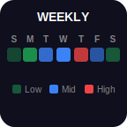</td>
</tr>
<tr>
<td align="center">Estimated $ based on your plan</td>
<td align="center">Compare all metrics side by side</td>
<td align="center">Usage trend over the last 24 hours</td>
<td align="center">Daily intensity over 7 days</td>
</tr>
</table>

---

## Multi-LLM support

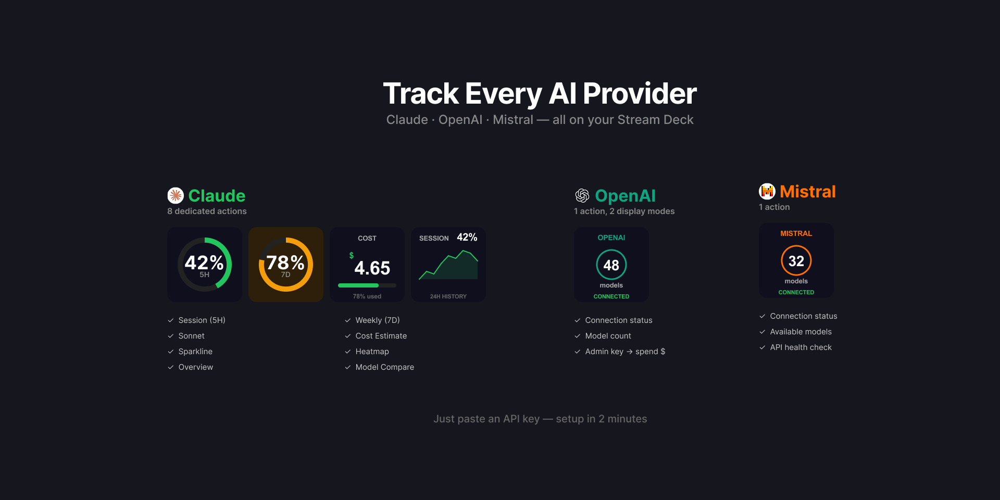

Track OpenAI and Mistral alongside Claude. Just paste an API key — no cookie extraction needed.

<table>
<tr>
<td align="center"><strong>OpenAI</strong></td>
<td align="center"><strong>Mistral</strong></td>
<td align="center"><strong>Error state</strong></td>
</tr>
<tr>
<td align="center">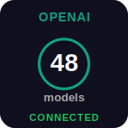</td>
<td align="center">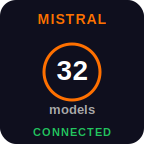</td>
<td align="center">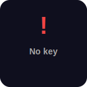</td>
</tr>
<tr>
<td align="center">Connection status + model count</td>
<td align="center">Connection status + model count</td>
<td align="center">Missing or invalid key</td>
</tr>
</table>

> With an OpenAI **organization admin key**, the display switches to showing actual spend in $ vs. your monthly limit.

---

## Smart color alerts

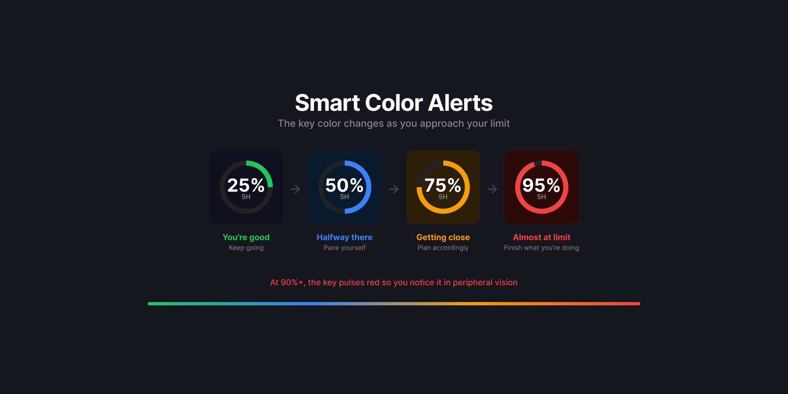

| What you see | What it means |
|:---|:---|
| Green | You're good. Keep going. |
| Blue | Halfway there. Pace yourself. |
| Amber | Getting close. Plan accordingly. |
| Red + pulsing glow | Almost at the limit. Finish what you're doing. |

> At 90%+, the key **pulses red** so you notice it even in peripheral vision.

---

## Setup in 2 minutes

### For Claude

The plugin includes a **step-by-step guide** directly in the settings panel. In short:

1. Open [claude.ai](https://claude.ai) in Chrome and log in
2. Press **F12** to open DevTools
3. Go to **Application** > **Cookies** > `https://claude.ai`
4. Find the row named **sessionKey** and copy its **Value**
5. Paste in the settings and press **Enter**

> Requires a Claude.ai **Pro** or **Team** account. The session key expires periodically — the plugin tells you when to refresh it.

### For OpenAI

1. Go to [platform.openai.com/api-keys](https://platform.openai.com/api-keys)
2. Copy your API key
3. Drag the OpenAI action onto your Stream Deck
4. Paste the key. Done.

> For billing data, use an **org admin key** from Settings > Organization > API Keys.

### For Mistral

1. Go to [console.mistral.ai](https://console.mistral.ai) > API Keys
2. Copy your API key
3. Drag the Mistral action onto your Stream Deck
4. Paste the key. Done.

### Settings

| Setting | Available on | Options | Default |
|:---|:---|:---|:---|
| Display Style | Session, Weekly, Sonnet, Overview | Gauge / Minimal / Full | Gauge |
| Theme | All actions | Dark / Light | Dark |
| Refresh | All actions | 1 / 5 / 10 min | 5 min |

> Press any key to force an instant refresh.

---

## Requirements

- Elgato Stream Deck with software **v6.9+**
- A [Claude.ai](https://claude.ai) account (Pro or Team)
- *(Optional)* An [OpenAI](https://platform.openai.com) API key
- *(Optional)* A [Mistral](https://console.mistral.ai) API key

---

## Install

Install directly from the [Elgato Marketplace](https://marketplace.elgato.com/product/ai-token-tracker-placeholder).

<!-- URL will be updated once the plugin is approved on the Marketplace -->

---

## Disclaimer

> This is an **unofficial tool**. It uses Claude.ai's internal web API via browser session cookies, OpenAI and Mistral APIs via API keys. These approaches may change at any time. **Use at your own risk.**

---

**Built for people who live in their terminal and on their Stream Deck.**

[Report an issue](https://github.com/aedhx/aitt.token-tracker-streamDeck/issues)

